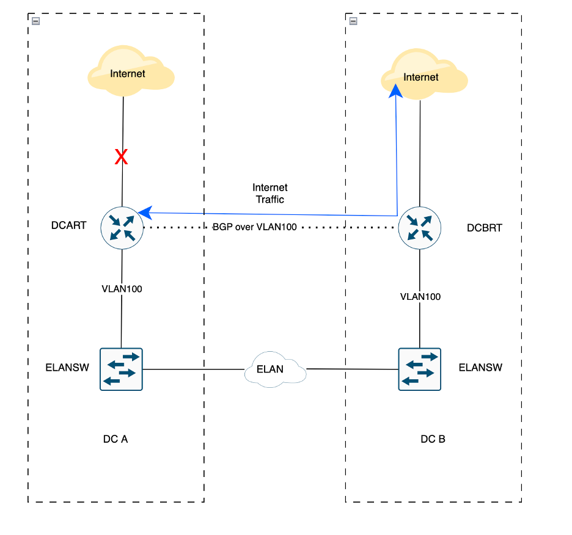
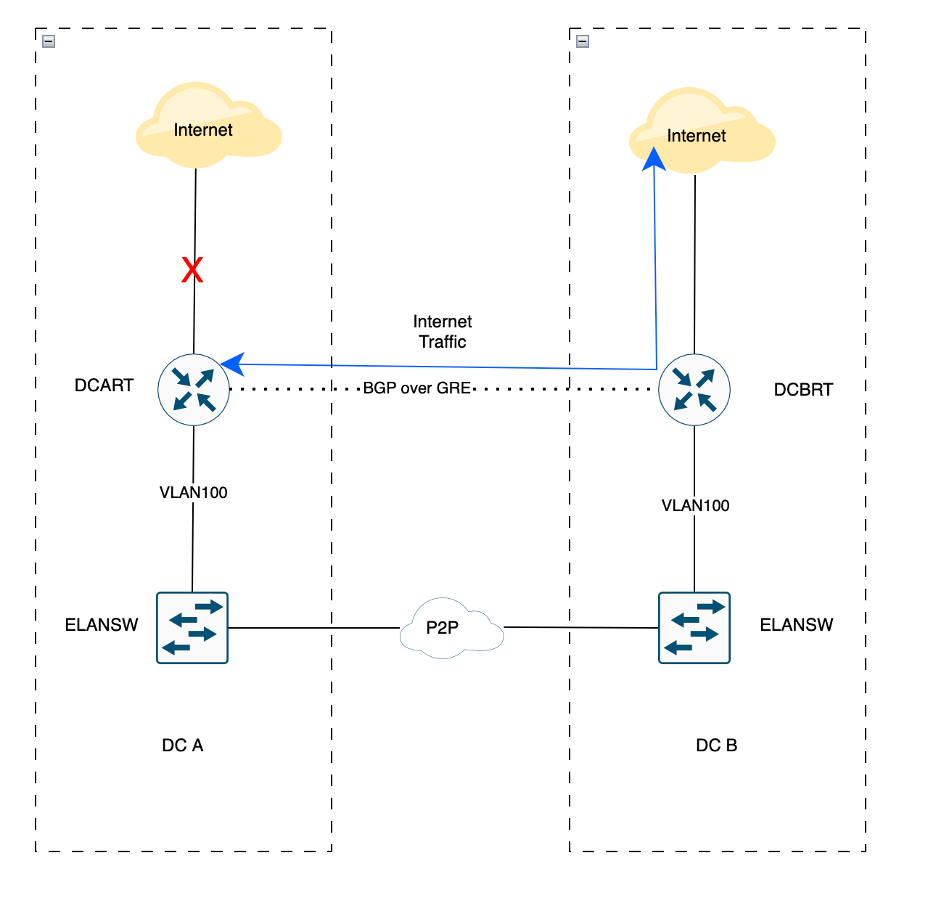

# Emergency Network Recovery: From Outage to Resolution

Around 5 PM, a car accident physically severed both internet circuits at our primary data center (DC A), triggering a major outage. VPN access—routed through DC A—went down immediately, cutting off all management access and documentation unless one was physically present at DC A or DC B. Our branch offices, which connect to DC A via SD-WAN, were also impacted. Microsoft Teams remained functional, but that was the only communications channel still up.

# Initial Situation
- DC A Internet: Down. Carrier confirmed it wouldn’t be restored for at least 24 hours—possibly up to a week.
- DC B: Fully functional with existing ELAN connectivity to DC A.
- All VPN, management, and documentation access: Unavailable unless on-site.

# Our Goal
Restore business and network connectivity at DC A, as quickly and safely as possible.

Option 1: Wait for Carrier

Estimated downtime: one week. Clearly unacceptable.

Option 2: Rebuild Edge from DC B

By 7 PM, my manager wanted to move forward with rerouting traffic through DC B. This meant:
- Changing the default route at DC A
- Copying all firewall policies from DC A to DC B
- Re-announcing all public IPs from DC B
- Redoing NAT and inbound rules

This would be a full edge migration under fire. Risky and unlikely to be completed within a week.
 
Option 3: Lightweight BGP Bridge

I proposed an alternative path—Option 3—a minimal, high-impact solution using existing connectivity.

Steps:
- Connect both DC A and DC B internet edge routers to the same ELAN switch
- Create a shared VLAN (VLAN 100) between them
- Establish BGP peering over this VLAN
- Have DC A advertise internal networks to DC B
- Let DC B announce DC A’s routes to the internet
- DC A receives default route from DC B

I explained the plan to my manager. He didn’t fully understand the technical details but trusted the direction. With CTO approval—“do whatever you can to restore service”—I headed to DC A at 10 PM.

By 11:30 PM, connectivity began to restore. Application teams started testing and restarting services. By 1 AM, everything was confirmed operational.

# Takeaways from the Field
•	Redundancy isn’t enough — it can still fail at the same time. Always have a Plan C.
•	Management access is everything. If I had remote access, I could’ve restored service without spending an hour driving.
•	Using P2P/MPLS instead of ELAN?
No problem — build a GRE tunnel between routers and run BGP over GRE for a similar failover strategy.

