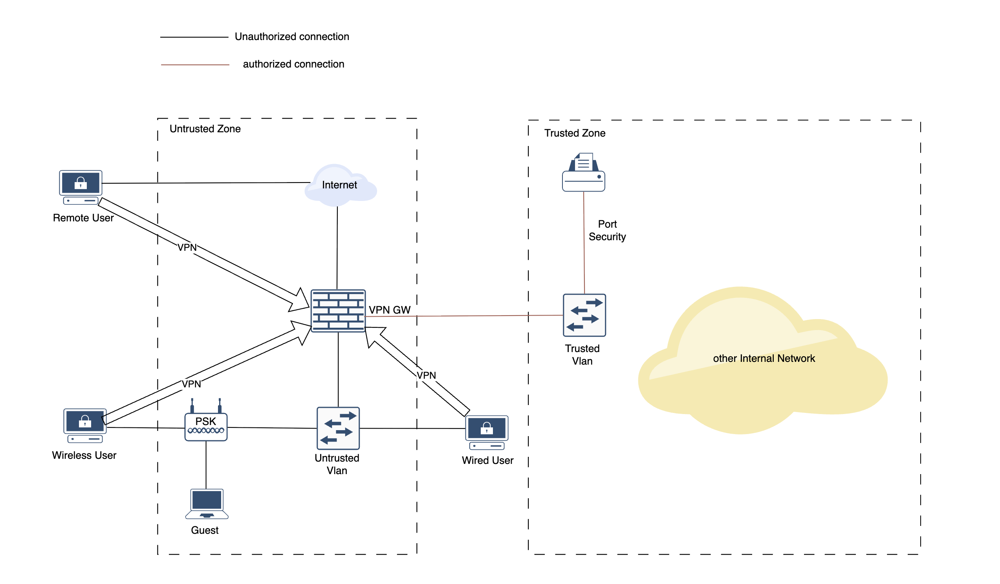

# From NAC to VPN: A Cleaner Model for Secure Network Access

## Introduction 

A switch malfunction flooded the ClearPass server with excessive logs, exhausting all disk space.

This prevented ClearPass from reaching the domain controller. Other services remained up, including RADIUS, but domain-based authentication was rejected.

After stopping the faulty switch, the ClearPass disk still stayed full. The 'rm' command was restricted to tech ONLY.

A case was opened with HPE Aruba support, HPE Aruba support classified as non-critical, with a four-hour response SLA.

TACACS+  was similarly affected, rejecting all requests while the service stayed up. NAC could not be disabled on switches to bypass radius.

The entire enterprise network became inaccessible for 4 hours until an tech engineer manually cleared the disk space.

## Traditional NAC Summary

Network Access Control (NAC) is a security approach designed to control which devices are allowed to connect to a network. In a traditional NAC model:

- A RADIUS server (such as Cisco ISE or Aruba ClearPass) acts as the decision-making brain.

- Switches and wireless APs function as authenticators, relaying authentication requests.

- Endpoints (laptops, phones, printers) must authenticate, often using 802.1X or MAC-based methods.

- Profiling tools, often fed by DHCP or passive sensors, classify devices when authentication is not possible.

Once authenticated, devices are assigned to appropriate VLANs or access profiles based on identity, type, or posture.

In theory, NAC provides dynamic, identity-based control at the point of network access, enforcing policies before devices can communicate within the network.

## Problems with Traditional NAC

### Too Many Moving Parts
Traditional NAC relies on a complex chain of systems — RADIUS servers, switches, APs, DHCP, profilers, certificate, and endpoint supplicants — all working perfectly together. Any malfunction in this chain can disrupt network access issues.
### High Fragility
Because of this heavy interdependency, even small failures — like a certificate mismatch, a DHCP delay, or a switch firmware bug — can break auth and block user access.
### Complex and Slow Troubleshooting
When problems occur, troubleshooting is difficult. Logs and events are scattered across different systems. Identifying the root cause often requires coordination across network, server, and security teams, slowing down incident response.
### Limited and Inefficient Control After Access
While NAC can push Downloadable ACLs (DACLs) to restrict device access after authentication, this approach is operationally weak:
- Switches are designed for fast packet forwarding, not deep security enforcement.
- ACL processing can degrade switch performance at scale.
- Logging and visibility on switch-enforced policies are limited, making monitoring and forensics difficult.
### User Experience Risk
Authentication delays or failures are visible to end users. If the NAC process is slow or unreliable, users perceive the entire network as unstable, even when the underlying infrastructure is healthy.

## Moving Toward a VPN-Centered Model

Traditional NAC tries to solve endpoint security at the network edge, but the complexity and fragility it introduces often outweigh its benefits.

Instead of relying on a chain of devices for user access control, a better model is to move enforcement up to the VPN layer, where access can be tied directly to user identity, not device location.

Under this model:
- The LAN is treated as an untrusted network by default. Switches and wireless access points are responsible only for basic connectivity, not for enforcing complex access policies.
- The MAB is replaced with port security, for infrastructure devices (printers, phones, etc)
- Entire Wirelss network are untrusted, using PSK for authorization. 
- All user devices—wired, wireless, or remote—establish a VPN session, even inside the office.
- The VPN gateway becomes the single enforcement point for identity, access control, and logging.

## Key Characteristics of the Design

### Zero Trust Network by default
Devices that are not explicitly authorized are placed into a default VLAN or DMZ with limited access — such as internet-only or captive portal access.
### Replacing MAB with port security
In practice, MAB is typically deployed with OUI filtering and device profiling, allowing attackers to spoof a matching MAC from an authorized vendor.

Port security, a decades-old built-in switch feature with no extra licensing cost, statically binds one or more specific MAC addresses to a port and drops frames from any unrecognized MAC. An attacker would need to know not only the vendor of the displaced device (e.g., a printer), but also its exact MAC address—information that is far harder to obtain when simply unplugging a cable.
### Entire Wireless network are untrusted
Because entire wireless are untrusted and enterprise traffic are protected by VPN. There is no need to deploy complicated wireless security, simple PSK is sufficient and avoids roaming issues, especially with Meraki wireless.
### VPN as Primary Access Path
All endpoint traffic passes through the VPN tunnel, regardless of user location. Authentication and access policies are enforced at the firewall or VPN concentrator.
### Centralized Policy and Monitoring
The firewall applies user/group-based security policies, QoS controls, and bandwidth limits.
All user traffic is logged and monitored centrally, without relying on switch or AP visibility.
### Simplified Incident Response
Revoking access for a compromised user is immediate — disconnect the VPN session or apply an emergency firewall rule.
There is no need to touch multiple systems or deal with NAC reauthentication timers.
### Scalable and Resilient
By removing complex authentication dependencies from the LAN, the network becomes simpler to operate, more resilient to authentication failures, and easier to scale as user counts grow.
### Unified User Experience
Remote and on-premise users have a consistent experience — both connect and work through the same VPN path, with identical policies, monitoring, and access behavior.
### Operational Simplicity and Cost Reduction

This approach removes the operational burden of 802.1X and its failure modes.

It also eliminates the licensing and maintenance cost of NAC platforms like ClearPass/ISE, which are some of the most expensive pieces of the access layer.

