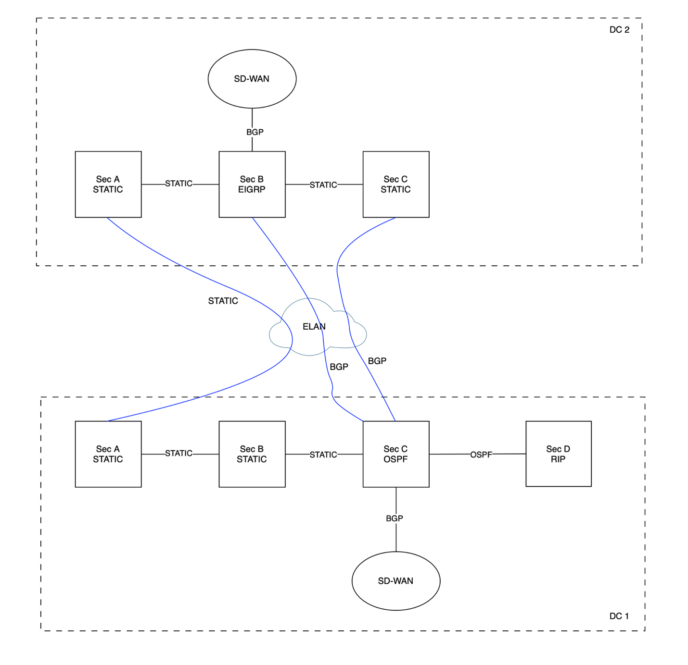
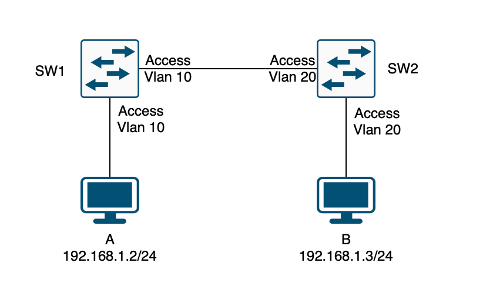
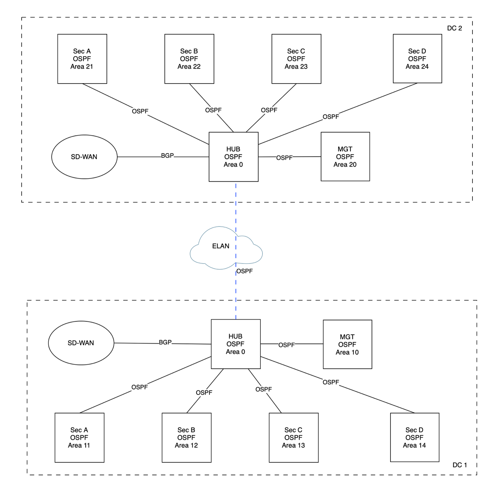
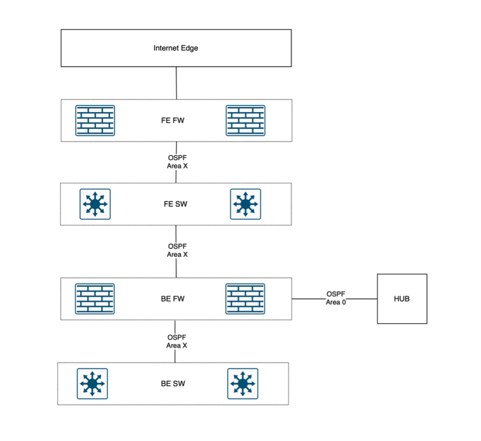
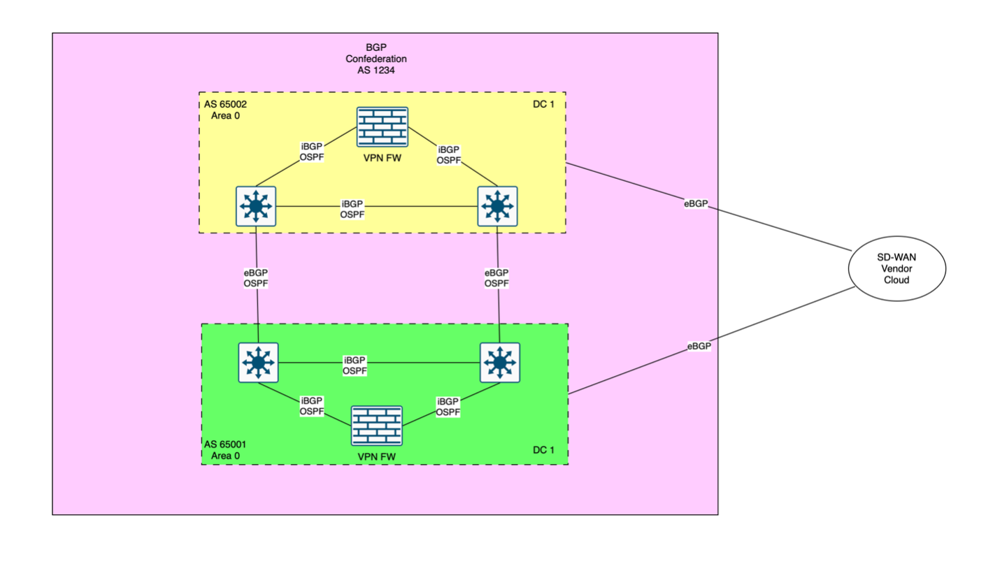
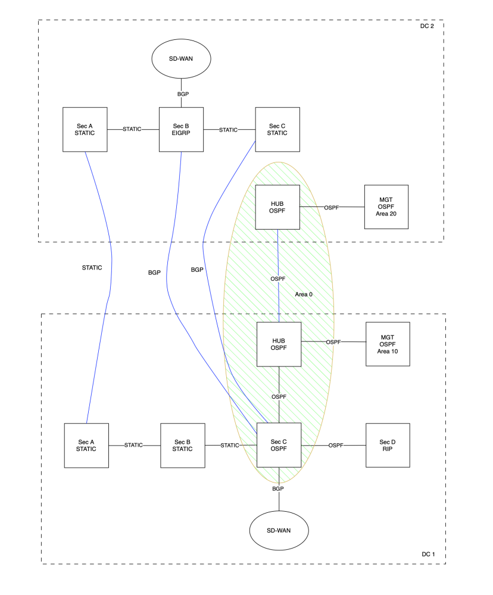

# **Turning Chaos into Clarity: A Real Network Cleanup Journey**

This is a redacted case study of a real enterprise network cleanup. Like many legacy environments, it suffered from years of patchwork changes, undocumented dependencies, and forgotten design intent.

⚠️ **Disclaimer:** Some diagrams and details have been altered or simplified to protect confidentiality. This article is shared for educational and professional discussion purposes only.

---

## **The Starting Point: Unorganized and Fragile**

The environment had all the signs of network drift:

- EOL hardware running outdated firmware
- Inconsistent topology with no clear design pattern
- Routing chaos: static routes, RIP, OSPF, EIGRP, BGP—all mixed, often conflicting
- Broken configs on top of broken logic
- No reliable documentation
- Unknown legacy: devices and configs with unclear purpose

Two data centers were connected via an ELAN bridge. Each section evolved in isolation. There was no standardization, and inter-segment communication relied on unpredictable paths.

## **Step 1: Documentation Before Action**

Before fixing anything, you must understand everything. Documentation is the foundation for any safe and effective cleanup.

Key discovery questions included:

- What business units does each section belong to?
- How is each unit subnetted?
- What devices are dedicated vs shared?
- How does internal and cross-segment communication work?
- What protocols and technologies are involved?
- Which problems are real, and which are illusions built from mistakes?

**Example: "Two Wrongs Make It Work"**

Host A is in VLAN 10. Host B is in VLAN 20. They can communicate.

- **Wrong 1**: Hosts are in different VLANs
- **Wrong 2**: SW1 port is Access VLAN 10, SW2 port is Access VLAN 20

The mismatched access ports make both switches believe the remote host is local. It works—accidentally. But fix either side and it breaks, causing business interruption.

## **Step 2: Redesign**

### **High-Level Hub-and-Spoke**

The new architecture follows a hub-and-spoke model:

- A central hub network runs OSPF Area 0
- Each business segment connects to the hub via its own OSPF area
- Inter-segment traffic flows through the hub, allowing policy enforcement
- ELAN extends OSPF backbone continuity between DC1 and DC2

This modular design supports fault isolation, growth, and control.

### **Segment Design**

Each business segment includes:

- **Frontend (FE)**: Internet-facing services, protected by FE firewall

- **Backend (BE)**: Internal services (apps, DB), protected by BE firewall

- The **BE firewall also serves as the ABR**:

  - Summarizes routes
  - Contains OSPF flapping
  - Controls cross-segment access

### **BGP for External Connectivity**

All cloud, SD-WAN, and vendor connections were migrated to a BGP confederation model:

- Each DC has its own sub-AS
- All external peers see a single unified AS
- Traffic from DC1 exits via DC1; traffic from DC2 exits via DC2
- In case of BGP failure, traffic fails over across the ELAN

This structure ensures clean external visibility and local autonomy, with failover between data centers when needed.

## **Step 3: Building the Hub Network**

To support the new design, I repurposed four unused Cisco 9Ks as hub switches. Section C in DC1 was already running OSPF, making it the ideal starting point.

- Hubs became the backbone for Area 0
- DC1 and DC2 were tied together via the ELAN
- All new connections (MGMT, segments, BGP) were routed through the hubs

This formed a clean, scalable routing core.

## **Step 4: Dedicated Management Network**

Previously, management interfaces were scattered across segments. I rebuilt a dedicated management network:

- All management interfaces are pulled into a centralized OSPF area
- No dependency on production routing
- Access is enforced via backend firewalls
- Reachable even during major outages

This vastly improved troubleshooting, monitoring, and operational control.
 The starting point after Hub and management network are built. 

## **Step 5: Migration by Opportunity**

Instead of scheduling separate migration windows, I aligned the transition with existing projects:

- Firewall replacement
- Cisco ACI migration

As each business segment was touched during these efforts, I:

- Rehomed it to the hub
- Migrated routing to OSPF
- Retired legacy protocols

Because change windows and rollback plans already existed, the risk was minimal, and migration happened smoothly without disruption.

## **Final Thoughts**

Turning a chaotic network into a structured one isn’t about having unlimited budget. Yes, replacing EOL devices requires investment—but the core of transformation is understanding the existing mess, defining business requirements, setting a clear architectural direction, and executing step by step.

With minimal resources and little downtime, I was able to:

- Eliminate routing chaos
- Reuse idle gear
- Build centralized control planes
- Migrate business segments without disruption
